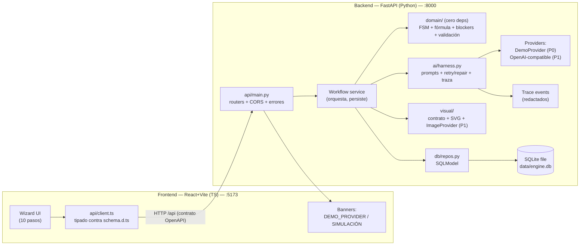
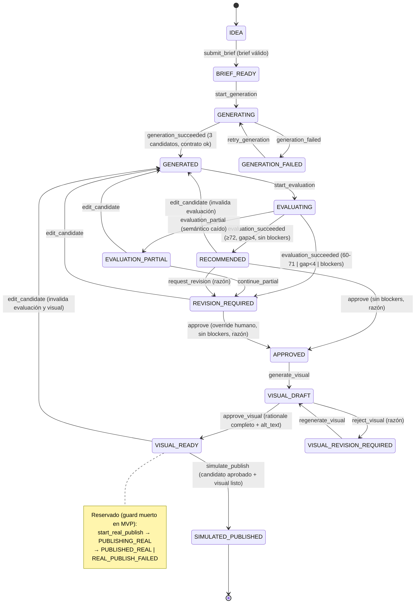
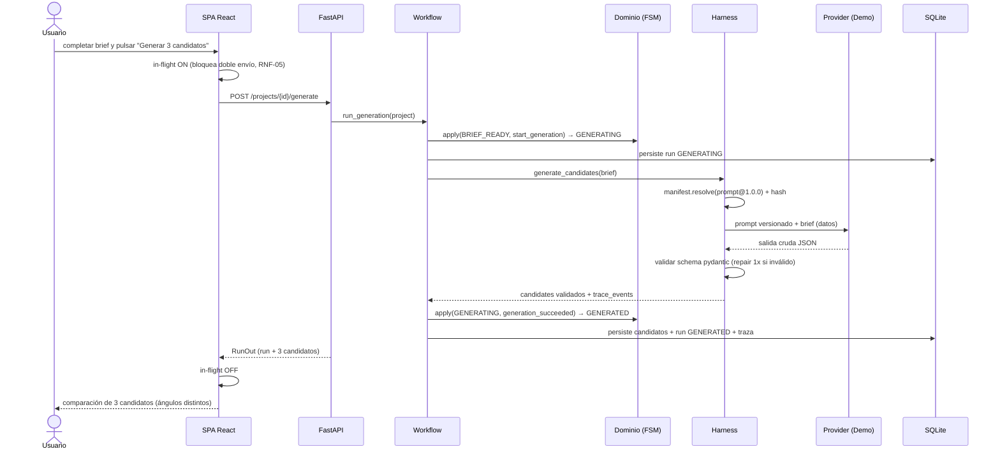
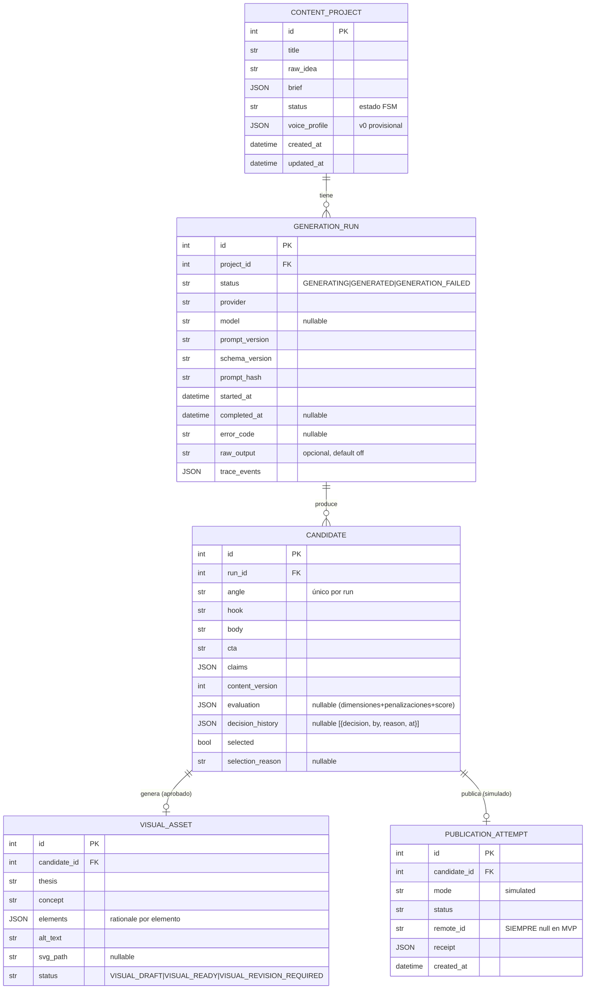
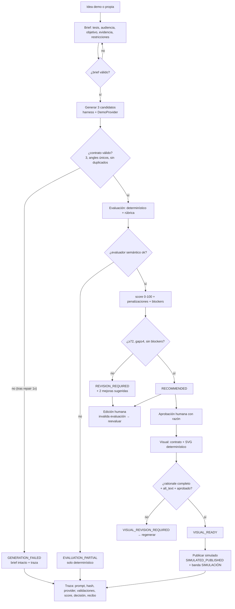

# Design: `linkedin-content-engine` — Motor editorial asistido por GenAI para LinkedIn (MVP local)

> Fase: `sdd-design` | Fecha: 2026-08-08 | Modo de persistencia: **hybrid** (openspec + Engram)
> Dependencias: `SOLUTION.md` (fuente de verdad: RF-01..07, RNF-01..05, §6.2 FSM, §7.2 fórmula, §11.1 entidades, §12 harness, §14 criterios), `openspec/init.md`, `openspec/changes/linkedin-content-engine/{proposal.md, exploration.md}`, Engram `sdd/linkedin-content-engine/{proposal,explore,state}` y `sdd-init/linkedin`.
> Código existente: **ninguno** — proyecto greenfield (solo `SOLUTION.md`). No hay repo git (se crea al inicio de apply).
> Regla de diseño aplicada (config.yaml): dominio puro separado del framework, contratos pydantic compartidos FE/BE, diagramas de secuencia para flujos complejos, decisiones con rationale.

---

## 1. Enfoque técnico (Technical Approach)

Workspace con **dos procesos coordinados por un script root** (`concurrently`), ejecutando de punta a punta `idea → brief → 3 candidatos → evaluación+blockers → aprobación humana → visual SVG → SIMULATED_PUBLISHED → traza`:

- **Frontend**: SPA React + Vite (TypeScript), wizard de pasos, etiquetas persistentes `DEMO_PROVIDER` y `SIMULACIÓN`.
- **Backend**: FastAPI (Python), dominio puro (cero dependencias) con FSM artesanal tipada + fórmula de evaluación transparente; SQLite en fichero vía **SQLModel**; GenAI harness con `DemoProvider` determinístico (P0) y adaptador OpenAI-compatible opcional (P1); SVG determinístico + adaptador de imagen opcional (P1).
- **Contrato**: pydantic es la fuente canónica; FastAPI expone `/openapi.json`; el frontend genera sus tipos TS desde ese contrato (`openapi-typescript`) y un **test de contrato** detecta drift (regenerar + diff + smoke de round-trip).
- **Estados honestos**: `SIMULATED_PUBLISHED` nunca es `PUBLISHED_REAL`; `PUBLISHED_REAL` es estado reservado e inalcanzable en el MVP.
- **Demo**: 100% local, sin API keys, sin cloud, sin OAuth, sin colas (RNF-01).

La frontera de capas sigue §10.3 de SOLUTION.md adaptada a dos procesos: UI ↔ API ↔ Workflow ↔ (Dominio puro | Harness GenAI | Visual | Repos SQLite). El workflow autoriza toda transición contra la FSM antes de persistir; nada muta estado sin pasar por el dominio.

---

## 2. Decisiones de arquitectura (ADRs)

| # | Decisión | Estado |
|---|---|---|
| ADR-001 | Workspace de dos procesos Vite+React + FastAPI (decisión de usuario, no se reabre) | Aceptada |
| ADR-002 | SQLModel sobre SQLAlchemy puro; Drizzle descartado | Aceptada |
| ADR-003 | pydantic canónico → OpenAPI → tipos TS generados + test de drift | Aceptada |
| ADR-004 | FSM artesanal tipada (tabla declarativa + guards) vs XState | Aceptada |
| ADR-005 | Retry/repair viven en el harness, no en el provider | Aceptada |
| ADR-006 | SVG determinístico como visual P0; `ImageProvider` opcional detrás de interfaz | Aceptada |
| ADR-007 | `SIMULATED_PUBLISHED` como estado terminal honesto; `PUBLISHED_REAL` reservado | Aceptada |
| ADR-008 | `create_all` idempotente + seed en P0; Alembic diferido a P1 | Aceptada |
| ADR-009 | Endpoints síncronos con in-flight en la UI (RNF-05); async diferido | Aceptada |

### Decision: ADR-001 — Workspace de dos procesos (Vite + FastAPI)

**Choice**: SPA React+Vite (TS) en `frontend/` + API FastAPI (Python) en `backend/`, coordinados por script root con `concurrently`; CORS + proxy de Vite.

**Alternatives considered**: Monolito Next.js monoproceso (recomendación original de §10.1 SOLUTION.md y de la exploración, Opción 1 ponderada 4.38); backend-first Streamlit (3.25); serverless/BaaS (2.80, viola RNF-01).

**Rationale**: Decisión confirmada por el usuario el 2026-08-08 (init.md y proposal.md) — supera la recomendación de exploración a propósito: ecosistema Python fuerte para iteración GenAI (semana 2), pydantic como contrato unificado con el harness, y perfil del dominio en Python. Tradeoffs aceptados y gestionados en este diseño: dos procesos (script root + proxy), contrato duplicado (ADR-003), doble toolchain (pines de versión). **No se reabre el debate.**

### Decision: ADR-002 — SQLModel sobre SQLAlchemy puro

**Choice**: SQLModel (`sqlmodel` ≥0.0.22) con SQLite en fichero (`data/engine.db`), repos finos sobre los 5 agregados de §11.1.

**Alternatives considered**: SQLAlchemy 2.0 puro (declarative + conversión manual a pydantic), Drizzle + better-sqlite3 (TypeScript), Prisma (codegen + engine binario).

**Rationale**: El proyecto ya usa pydantic como contrato canónico. SQLModel unifica modelo de datos y validación en una clase pydantic, eliminando la duplicación declarative→pydantic; se apoya en SQLAlchemy 2.0 (sesiones, transacciones, futuro Alembic); mismo autor que FastAPI. Drizzle queda descartado porque el dominio y la persistencia viven en Python. Si un caso no lo cubre, se degrada a SQLAlchemy puro sin cambiar la interfaz de repos.

### Decision: ADR-003 — Contrato canónico pydantic + tipos TS generados + test de drift

**Choice**: Los modelos pydantic de `backend/api/schemas.py` son la única fuente de verdad del contrato. FastAPI genera `/openapi.json` automáticamente. El frontend genera `frontend/src/api/schema.d.ts` con `openapi-typescript` (`npm run schema:generate`) y lo commitea. Un test de contrato (vitest) falla si el contrato vivo difiere del commitado (regenerar + diff) y ejecuta un smoke de round-trip contra la API real.

**Alternatives considered**: (a) espejo TS escrito a mano verificado por test; (b) `datamodel-code-generator` (pydantic→TS en build); (c) Zod como contrato FE duplicado.

**Rationale**: La generación elimina el drift a nivel de tipos (una sola fuente). El test de drift convierte el "olvidé regenerar" en un fallo de CI. Zod queda restringido a validación de formularios locales del FE (superficie mínima), no al contrato, para no crear un segundo espejo. Detalle completo en §5.

### Decision: ADR-004 — FSM artesanal tipada vs XState

**Choice**: Tabla declarativa de transiciones `(source, event, guard, target)` en `backend/domain/fsm.py`, módulo puro con stdlib; `apply(state, event, ctx) -> TransitionResult`.

**Alternatives considered**: XState (JS), librerías de máquinas de estado en Python, FSM por if/else ad-hoc.

**Rationale**: ~17 estados con guards es el punto dulce de una tabla pura: testeable con tests de tabla (una fila por transición legal e ilegal), sin dependencias nuevas, y el dominio debe ser cero-deps (config.yaml: "dominio puro separado del framework"). XState agrega concepto y dependencia sin beneficio a esta escala.

### Decision: ADR-005 — Retry/repair en el harness, no en el provider

**Choice**: `ai/harness.py` orquesta reintentos (2 reintentos con backoff ante errores transitorios) y la reparación única de JSON inválido (usando el error del esquema, sin reescribir contenido). Los providers solo llaman y devuelven crudo o levantan errores tipados.

**Alternatives considered**: retry dentro del provider; librería genérica de retry (tenacity).

**Rationale**: La política de reintentos y reparación es transversal a cualquier provider y debe quedar trazada en la misma capa; si vive en el provider, el DemoProvider tendría que reimplementarla. Sin tenacity: 3 intentos con backoff es trivial en stdlib y evita una dependencia.

### Decision: ADR-006 — SVG determinístico + ImageProvider opcional

**Choice**: `visual/` construye un contrato visual desde la tesis aprobada (sin LLM), lo valida (todo elemento con `rationale` no vacío, `alt_text` obligatorio, elementos prohibidos) y renderiza una tarjeta SVG 1200×630 con una plantilla editorial parametrizada. `ImageProvider` es una interfaz opcional (P1) detrás de `VISUAL_PROVIDER=image`; fallo → fallback a SVG **con aviso y traza**, nunca conmutación silenciosa.

**Alternatives considered**: modelo generativo de imágenes en P0; imagen fotorrealista; solo texto.

**Rationale**: §8 de SOLUTION.md exige reproducibilidad y auditoría del vínculo visual-tesis; un SVG determinístico es más rápido, reproducible y auditable en 24 h. La interfaz deja la puerta abierta a generación sin cambiar el flujo.

### Decision: ADR-007 — Estados honestos de publicación

**Choice**: `PublicationAttempt` con `mode="simulated"`, `status=SIMULATED_PUBLISHED`, recibo local sin `remote_id`. `PUBLISHING_REAL` / `PUBLISHED_REAL` / `REAL_PUBLISH_FAILED` existen en la FSM como estados **reservados** con guard `real_publish_enabled()` que siempre falla en el MVP.

**Alternatives considered**: mismo estado con flag; simular con un ID inventado; omitir los estados reservados.

**Rationale**: §6.2/§9.3 — la integridad exige que `PUBLISHED_REAL` solo pueda existir con respuesta verificable de la API real; declararlo en la FSM con guard muerto hace que la imposibilidad sea verificable por test, no por convención.

### Decision: ADR-008 — Migraciones: `create_all` + seed en P0, Alembic en P1

**Choice**: En P0, `SQLModel.metadata.create_all()` idempotente al arranque + seed reproducible (`db/seed.py`, solo si está vacío). Migraciones Alembic diferidas a P1 (SQLModel lo soporta vía autogenerate).

**Alternatives considered**: Alembic desde P0; migraciones SQL a mano.

**Rationale**: MVP sin datos en producción; la DB demo es descartable (borrar `data/engine.db` regenera todo). Alembic desde el día 1 agrega piezas y tiempo que el flujo P0 no necesita. Documentado en README y §18.

### Decision: ADR-009 — Endpoints síncronos con in-flight en la UI

**Choice**: Todos los endpoints P0 son síncronos (el request devuelve el resultado cuando termina). La UI mantiene estado en curso por operación y bloquea envíos duplicados (RNF-05). Async/jobs solo si P1 OpenAI lo exige.

**Alternatives considered**: cola + polling/WebSocket; tasks Celery.

**Rationale**: DemoProvider es instantáneo; el único caso lento (OpenAI P1) aún es tolerable con un timeout de 60 s y la UI bloqueada con spinner. Colas/WebSocket violan el recorte "sin colas" y no resuelven el riesgo principal del MVP.

---

## 3. Arquitectura de componentes



**Responsabilidades** (SOLUTION.md §10.4, repartidas en dos procesos):

| Componente | Responsabilidad |
|---|---|
| UI (FE) | Capturar brief, comparar candidatos, editar, aprobar, mostrar estados y banners |
| Workflow (BE) | Autorizar transiciones contra la FSM, aplicar reglas de decisión, persistir eventos |
| Dominio puro (BE) | FSM, fórmula, penalizaciones, blockers, validaciones determinísticas — sin deps |
| GenAI harness (BE) | Resolver prompts versionados, invocar provider, validar, reintentar/reparar, trazar |
| Evaluador (BE) | Chequeos determinísticos + rúbrica + penalizaciones + regla de decisión |
| Visual (BE) | Contrato visual + render SVG reproducible (+ ImageProvider opcional) |
| Repos (BE) | Persistir ejecuciones, versiones, decisiones y recibos en SQLite |
| Provider adapter (BE) | Ocultar diferencias de SDK/modelo y normalizar errores |

---

## 4. Dominio desacoplado con FSM

### 4.1 Principios

- `backend/domain/` importa **solo stdlib** (dataclasses, enum, typing, re). Cero pydantic, cero SQLAlchemy, cero FastAPI.
- El workflow (capa de aplicación) es el único que habla con la FSM y con los repos; el dominio no sabe de HTTP ni de DB.
- Toda mutación de estado pasa por `apply(state, event, ctx)`; si la transición es ilegal, se rechaza con razón (→ HTTP 409).
- Los tests de dominio corren con repos in-memory, sin HTTP ni DB.

### 4.2 Estados, eventos y tabla de transiciones

**Estados (14 activos + 3 reservados):**

`IDEA`, `BRIEF_READY`, `GENERATING`, `GENERATED`, `EVALUATING`, `EVALUATION_PARTIAL`, `RECOMMENDED`, `REVISION_REQUIRED`, `APPROVED`, `VISUAL_DRAFT`, `VISUAL_READY`, `VISUAL_REVISION_REQUIRED`, `SIMULATED_PUBLISHED`, `GENERATION_FAILED` — reservados: `PUBLISHING_REAL`, `PUBLISHED_REAL`, `REAL_PUBLISH_FAILED`.

La FSM modela el **flujo del proyecto** (status del agregado `ContentProject`); las decisiones por candidato (evaluación, `decision`, `selected`, aprobación) viven en `Candidate` y los guards las verifican (p. ej. `approve` exige un candidato sin blockers).

| # | Desde | Evento | Guard | Hacia |
|---|---|---|---|---|
| 1 | IDEA | `submit_brief(brief)` | brief válido (tesis única + ≥1 evidencia/opinión autorizada) | BRIEF_READY |
| 2 | BRIEF_READY | `start_generation` | — | GENERATING |
| 3 | GENERATING | `generation_succeeded(candidates)` | contrato válido, exactamente 3, `angle` únicos, hooks/bodies no idénticos normalizados | GENERATED |
| 4 | GENERATING | `generation_failed(error_code)` | — | GENERATION_FAILED |
| 5 | GENERATION_FAILED | `retry_generation` | brief sigue válido | GENERATING |
| 6 | GENERATED | `start_evaluation` | — | EVALUATING |
| 7 | EVALUATING | `evaluation_succeeded(scores)` | regla de decisión (§4.5); `RECOMMENDED` exige mejor candidato sin blockers | RECOMMENDED \| REVISION_REQUIRED |
| 8 | EVALUATING | `evaluation_partial(deterministic)` | evaluador semántico falló | EVALUATION_PARTIAL |
| 9 | EVALUATION_PARTIAL | `continue_partial` | — | REVISION_REQUIRED |
| 10 | RECOMMENDED | `edit_candidate` | cambios reales; invalida evaluación (+ visual si existía) | GENERATED |
| 11 | REVISION_REQUIRED | `edit_candidate` | ídem | GENERATED |
| 12 | EVALUATION_PARTIAL | `edit_candidate` | ídem | GENERATED |
| 13 | VISUAL_DRAFT | `edit_candidate` | ídem (invalida visual) | GENERATED |
| 14 | VISUAL_READY | `edit_candidate` | ídem | GENERATED |
| 15 | RECOMMENDED | `request_revision(reason)` | razón registrada | REVISION_REQUIRED |
| 16 | RECOMMENDED | `approve(candidate_id, reason)` | candidato sin blockers; razón registrada | APPROVED |
| 17 | REVISION_REQUIRED | `approve(candidate_id, reason)` | ídem (override humano explícito, §6.2) | APPROVED |
| 18 | APPROVED | `generate_visual` | candidato aprobado | VISUAL_DRAFT |
| 19 | VISUAL_DRAFT | `approve_visual` | contrato válido: todo elemento con rationale, `alt_text` no vacío | VISUAL_READY |
| 20 | VISUAL_DRAFT | `reject_visual(reason)` | — | VISUAL_REVISION_REQUIRED |
| 21 | VISUAL_REVISION_REQUIRED | `regenerate_visual` | — | VISUAL_DRAFT |
| 22 | VISUAL_READY | `simulate_publish` | candidato APPROVED + visual VISUAL_READY | SIMULATED_PUBLISHED |
| 23 | VISUAL_READY | `start_real_publish` | **guard muerto**: `real_publish_enabled()` == False | PUBLISHING_REAL (reservado) |
| 24 | PUBLISHING_REAL | `publish_succeeded(remote_id)` | respuesta verificable real (nunca en MVP) | PUBLISHED_REAL (reservado) |
| 25 | PUBLISHING_REAL | `publish_failed` | — | REAL_PUBLISH_FAILED (reservado) |

### 4.3 Implementación (sketch de contrato)

```python
# backend/domain/fsm.py  — stdlib only
STATES: frozenset[str]
EVENTS: frozenset[str]

@dataclass(frozen=True)
class Transition:
    source: str
    event: str
    guard: Callable[["FsmContext"], GuardResult] | None   # None = sin guard
    target: str

TRANSITIONS: tuple[Transition, ...] = ( ... )  # tabla declarativa §4.2

@dataclass(frozen=True)
class TransitionResult:
    ok: bool
    state: str | None      # estado resultante si ok
    reason: str | None     # motivo si rechazada

def apply(state: str, event: str, ctx: "FsmContext") -> TransitionResult:
    # busca (state, event) en TRANSITIONS, evalúa guard, devuelve resultado
```

`FsmContext` expone lo que los guards necesitan: brief, candidatos, evaluación, blockers, visual, flag de proveedor real. Sin contexto válido → `TransitionResult(ok=False, reason=...)`.

### 4.4 Fórmula de evaluación (`domain/score.py`)

```python
DIMENSION_WEIGHTS = {
    "hook": 0.20, "niche_relevance": 0.20, "specificity_evidence": 0.20,
    "clarity": 0.15, "conversation_potential": 0.15, "voice_fit": 0.10,
}  # suma = 1.0

def dimension_100(rating: int) -> float:      # rating 0..5 → rating * 20
def base_score(dimensions: dict[str, int]) -> float
def clamp(v, lo=0.0, hi=100.0) -> float

PENALTY_RISK_INVENTED_EXPERIENCE = 25         # experiencia personal inventada
PENALTY_RISK_PER_UNSUPPORTED_CLAIM = 10       # cifra/afirmación absoluta sin evidencia, máx 25
PENALTY_GENERICITY_PER_CLICHE = 5             # cliché/tesis intercambiable/repetición, máx 15

def penalizacion_riesgo(claims, evidence) -> float
def penalizacion_genericidad(text, cliche_catalog, other_candidates) -> float
def score_final(base, risk, generic) -> int   # round(clamp(base - risk - generic))
```

**Regla de validez de la nota**: cada dimensión requiere `quote` (frase del candidato) + `rubric_rule` (regla de la rúbrica versionada). Una nota sin ambas referencias es inválida → el evaluador semántico queda marcado fallido (→ `EVALUATION_PARTIAL`).

### 4.5 Blockers y regla de decisión (`domain/blockers.py`)

Blockers (impiden `RECOMMENDED` y `APPROVED` hasta resolución):
- Claim sin soporte: cifra o afirmación absoluta no presente en la evidencia del brief (ni en `known_facts`).
- Experiencia personal inventada atribuida a Juan sin evidencia aprobada.
- Contenido prohibido (§12.4: ataques personales, secretos, datos personales, consejos como garantía, imitación de personas vivas).
- Flag `needs_review` sin resolver.

```python
@dataclass(frozen=True)
class Decision:
    outcome: Literal["RECOMMENDED", "REVISION_REQUIRED"]
    best_candidate_id: int | None
    reason: str
    brief_needs_revision: bool = False

def decide(scores, blockers, top2_gap) -> Decision:
    # blockers → REVISION_REQUIRED (aunque score ≥ 72)
    # best ≥ 72 y gap ≥ 4 → RECOMMENDED
    # best en [60,71] o gap < 4 → REVISION_REQUIRED + 2 mejoras de mayor impacto
    # todos < 60 → REVISION_REQUIRED con brief_needs_revision=True (reformular brief, no regenerar infinito)
```

Umbrales versionados y calibrables: `THRESHOLD_RECOMMEND=72`, `MIN_TOP_GAP=4`, `THRESHOLD_REVISION_LOW=60` (SOLUTION.md §7.3), expuestos en la UI como constantes documentadas.

### 4.6 Diagrama de estados



---

## 5. Contrato canónico FE/BE y estrategia anti-drift

### 5.1 Fuente canónica

- Todos los modelos de request/response viven en `backend/api/schemas.py` como **pydantic** (`BaseModel`, `Field`, `Literal`, `model_validator`).
- FastAPI los usa en los endpoints → genera `/openapi.json` automáticamente (disponible en dev; `docs` y `redoc` habilitados en `APP_ENV=dev`).
- Los schemas del harness GenAI (`ai/contracts.py`) reutilizan los mismos modelos pydantic de candidatos/evaluación: **el mismo schema que valida la salida LLM es el del contrato API**. Una sola definición.

### 5.2 Generación de tipos TS (estrategia concreta)

1. Script npm raíz `schema:generate`: `openapi-typescript http://localhost:8000/openapi.json -o frontend/src/api/schema.d.ts` (requiere backend levantado; el CI/test lo arranca).
2. `frontend/src/api/schema.d.ts` se **commitea** (tipos estables para el resto del FE).
3. El FE importa ÚNICAMENTE de `schema.d.ts` (`components["schemas"]["CandidateOut"]`, etc.). Prohibido definir DTOs de API a mano (excepto tipos locales de formulario).
4. Zod queda restringido a validación local de formularios del FE (campos obligatorios, longitud), no al contrato — evita un segundo espejo.

### 5.3 Tests de contrato (drift guard) — vitest, suite `contract`

| Test | Qué detecta | Cómo |
|---|---|---|
| `openapi-drift` | El `schema.d.ts` commitado quedó viejo respecto del backend vivo | Regenera a temp y compara byte a byte con el commitado; fallo = "corré `npm run schema:generate`" |
| `roundtrip-smoke` | El FE interpreta mal el contrato real (nombres/tipos) | Con backend vivo: POST brief demo → POST generate (DemoProvider) → valida la respuesta contra el JSON Schema de `/openapi.json` y compila contra `schema.d.ts` |
| `schema-coverage` | El FE usa campos que el backend eliminó/renombró | Check estático: cada campo referenciado en `src/**` existe en `schema.d.ts` (regla TS + test) |

En CI/local: `npm run schema:check` = generar a temp + `diff --exit-code`. Sin backend levantado la suite `contract` se omite (tag), pero el drift-check se puede correr contra el `openapi.json` commiteado si se decide cachear uno (decisión de apply).

### 5.4 Endpoints REST

| Método y ruta | Request (pydantic) | Response | Transición FSM |
|---|---|---|---|
| `GET /api/health` | — | `HealthOut` | — |
| `GET /api/ideas/demo` | — | `list[DemoIdeaOut]` | — |
| `POST /api/projects` | `ProjectCreate{raw_idea, title?}` | `ProjectOut` | IDEA |
| `POST /api/projects/{id}/brief` | `BriefIn` | `ProjectOut` | → BRIEF_READY |
| `GET /api/projects/{id}` | — | `ProjectDetailOut` (brief, status, voz aplicada) | — |
| `POST /api/projects/{id}/generate` | — | `RunOut` (run + candidatos) | → GENERATING → GENERATED \| GENERATION_FAILED |
| `POST /api/projects/{id}/retry-generate` | — | `RunOut` | → GENERATING (desde GENERATION_FAILED) |
| `GET /api/runs/{run_id}` | — | `RunDetailOut` (traza completa redactada) | — |
| `POST /api/runs/{run_id}/evaluate` | — | `EvaluationOut` (scores, penalizaciones, decision, mejor candidato) | → RECOMMENDED \| REVISION_REQUIRED \| EVALUATION_PARTIAL |
| `POST /api/candidates/{id}/edit` | `CandidateEdit{content}` | `CandidateOut` | → GENERATED (invalida evaluación/visual) |
| `POST /api/candidates/{id}/request-revision` | `ReasonIn` | `CandidateOut` | → REVISION_REQUIRED |
| `POST /api/candidates/{id}/approve` | `ReasonIn` | `CandidateOut` | → APPROVED |
| `POST /api/candidates/{id}/visual` | — | `VisualOut` (contrato + rationale + alt_text) | → VISUAL_DRAFT |
| `POST /api/visuals/{id}/approve` | — | `VisualOut` | → VISUAL_READY |
| `POST /api/visuals/{id}/reject` | `ReasonIn` | `VisualOut` | → VISUAL_REVISION_REQUIRED |
| `GET /api/visuals/{id}/svg` | — | `image/svg+xml` (archivo local) | — |
| `POST /api/candidates/{id}/publish-simulated` | — | `PublicationOut` (recibo local) | → SIMULATED_PUBLISHED |
| `GET /api/projects` | — | `list[ProjectOut]` (historial P1, ya soportado por SQLite) | — |

### 5.5 Contratos pydantic (sketch, canónico)

```python
# backend/api/schemas.py — contrato canónico FE/BE
class BriefIn(BaseModel):
    thesis: str            # tesis única (MUST, no vacía)
    audience: str
    objective: str
    evidence: list[EvidenceItem]   # known_facts / author_opinions / open_questions
    constraints: list[str] = []

class CandidateOut(BaseModel):
    id: int; angle: Literal["problem-story", "practical-framework", "argued-position"]
    hook: str; body: str; cta: str
    claims: list[ClaimOut]           # text + support (brief_evidence_id | author_opinion | needs_review)
    content_version: int
    evaluation: EvaluationSummary | None
    decision: str | None

class GenerationOutput(BaseModel):   # = salida validada del harness (misma clase FE/BE)
    candidates: list[CandidateOutput]   # exactamente 3, angles únicos (model_validator)

class EvaluationOutput(BaseModel):
    candidate_scores: list[CandidateScore]
    # CandidateScore: dimensions{6 × rating 0..5 + quote + rubric_rule}, penalties{risk, generic}, score_final, blockers[]
class DecisionOut(BaseModel):
    outcome: Literal["RECOMMENDED", "REVISION_REQUIRED"]; best_candidate_id: int | None
    reason: str; brief_needs_revision: bool
class VisualContract(BaseModel):
    thesis: str; concept: str
    elements: list[VisualElement]      # element + description + rationale (frase de la tesis)
    alt_text: str; status: str
class ReceiptOut(BaseModel):           # recibo SIMULATED_PUBLISHED
    id: int; mode: Literal["simulated"]; status: Literal["SIMULATED_PUBLISHED"]
    candidate_id: int; visual_id: int; created_at: str
    notice: Literal["no se envió contenido a LinkedIn"]
    remote_id: None = None             # jamás un ID remoto inventado
```

---

## 6. GenAI harness

### 6.1 Prompts versionados + manifiesto

- Archivos en `backend/ai/prompts/`:
  - `linkedin-candidate-generator@1.0.0.md`
  - `editorial-evaluator@1.0.0.md`
- `manifest.json` (versionado): por capacidad → `{file, version, schema_version, sha256}`. El harness resuelve el prompt por id, calcula el hash al cargar y lo guarda en la traza. **Cambiar instrucciones o contrato exige subir versión.**
- Estructura del prompt: propósito, contexto permitido, reglas de voz v0 (provisional), separación sistema/datos con delimitadores, formato de salida JSON (contrato), ejemplos mínimos, prohibiciones. La evidencia del brief viaja como **datos**, nunca como instrucciones (§12.4).

### 6.2 Interfaz `GenAIProvider`

```python
# backend/ai/providers.py
class ProviderError(Exception): code: str  # TRANSIENT | INVALID_OUTPUT | UNAVAILABLE

class GenAIProvider(Protocol):
    name: str                     # "DEMO_PROVIDER" | "openai-compatible"
    def generate_candidates(self, brief: BriefIn) -> GenerationOutput: ...
    def evaluate_candidates(self, candidates, brief, catalog_version) -> EvaluationOutput: ...
```

Los providers devuelven **salidas ya validadas por schema** (el harness valida; si el provider devuelve algo inválido, el harness lo rechaza igual). El modelo y parámetros relevantes se exponen en metadatos para la traza.

### 6.3 `DemoProvider` determinístico (P0)

- **Sin random, sin red**: fixtures derivados del brief (no fijos): los tres ángulos `problem-story`, `practical-framework`, `argued-position` se rellenan con la tesis, audiencia y evidencia reales del brief; `claims` mapean a los ids de evidencia del brief (vacíos si no hay evidencia → el candidato cae en blockers de claim, útil para demo de regla).
- Atraviesa **los mismos schemas, validaciones, guards y trazas** que un provider remoto: `name="DEMO_PROVIDER"`, `model=None`; la UI y la traza lo etiquetan.
- Modo de fallo demostrable: `DEMO_FORCE_INVALID=1` devuelve JSON inválido para recorrer el camino `repair → validation_failed → GENERATION_FAILED` (segundo caso de la demo, §15 SOLUTION.md).

### 6.4 Adaptador OpenAI-compatible (P1, opcional)

- `backend/ai/openai_compat.py`: httpx POST a `${OPENAI_BASE_URL}/chat/completions` con `OPENAI_API_KEY`, `OPENAI_MODEL`, `temperature=0.4` (moderada), `timeout=60s`, `response_format={"type": "json_object"}` cuando el endpoint lo soporte.
- Activo solo si `GENAI_PROVIDER=openai` y hay key: sin key/red → error tipado → la UI sugiere `DemoProvider`; nunca se conmuta automáticamente sin avisar (§12.7). Proveedor y modelo quedan en la traza.

### 6.5 Retry/repair en el harness (`ai/harness.py`)

```
run_generation(brief):
  prompt = manifest.resolve("linkedin-candidate-generator@1.0.0")   # + hash en traza
  for attempt in 1..3:                        # intento inicial + 2 reintentos
    try: raw = provider.generate(prompt, brief)
    except TRANSIENT: if attempt < 3: backoff(0.5s, 1.5s); traza(retry_scheduled); continue
                     else: return RunResult.failed("PROVIDER_TRANSIENT_ERROR")
    if validate(raw): return success(candidates)                    # pydantic
    if attempt == 1:
        repaired = repair_once(raw, validation_error)               # 1 sola reparación
        if validate(repaired): traza(repair_ok); return success
        traza(repair_failed)
    traza(validation_failed)
  return RunResult.failed("INVALID_OUTPUT")                          # → GENERATION_FAILED
```

- `repair_once`: re-parsea el JSON usando el error del schema como feedback; **nunca reescribe contenido silenciosamente**; una única vez.
- Evaluador semántico caído → `evaluation_partial`: solo chequeos determinísticos + "evaluación semántica no disponible"; **no se fabrica un score completo** (RF-03).

### 6.6 Formato de traza (por ejecución)

```json
{
  "trace_events": [
    {"ts": "…", "type": "prompt_resolved", "prompt_id": "linkedin-candidate-generator@1.0.0",
     "prompt_hash": "sha256:…", "schema_version": "1.0.0"},
    {"ts": "…", "type": "provider_invoked", "provider": "DEMO_PROVIDER", "model": null,
     "params": {"temperature": 0.4}, "attempt": 1},
    {"ts": "…", "type": "output_validated", "checks": [{"name": "schema", "ok": true}, …]},
    {"ts": "…", "type": "evaluation_scored", "candidate_id": 3, "score_final": 74,
     "dimensions": {"hook": 4, …}, "penalties": {"risk": 0, "generic": 6},
     "decision": "RECOMMENDED", "best_candidate_id": 3}
  ]
}
```

Eventos tipados: `prompt_resolved | provider_invoked | output_validated | validation_failed | repair_ok | repair_failed | retry_scheduled | evaluation_scored | generation_failed`. `raw_output` se guarda **solo si `TRACE_STORE_RAW_OUTPUT=true`** (por defecto `false`: hash o descarte). Redacción de secretos siempre aplicada (§13).

### 6.7 Secuencia: generación (flujo complejo)



---

## 7. Visual: SVG determinístico + image provider opcional

`backend/visual/` (sin LLM, sin red en P0):

1. `contract.py — build_visual_contract(thesis, candidate)`: mapa keyword→concepto versionado (p. ej. tesis con "conocimiento operativo" → concepto "capa visible de código vs capa oculta de reglas y excepciones"); genera `elements[]` con `{element_id, kind, description, rationale}` — cada `rationale` cita una frase o concepto literal de la tesis.
2. `validate.py`: todo elemento con `rationale` no vacío; `alt_text` no vacío y específico; elementos prohibidos (marcas no autorizadas, estereotipos retro sin relación argumental) → rechazo → `VISUAL_REVISION_REQUIRED`.
3. `svg.py — render_svg(contract)`: una plantilla editorial parametrizada, 1200×630, texto corto (tesis), metáfora visual (figuras), elementos de dominio; se escribe en `data/visuals/{visual_id}.svg` y se sirve por `GET /api/visuals/{id}/svg` (`image/svg+xml`).
4. `image_provider.py` (P1): interfaz `ImageProvider.generate(contract) -> ImageAsset` detrás de `VISUAL_PROVIDER=image` (desactivado por defecto). Fallo → fallback a SVG con aviso en UI + traza; **nunca conmutación silenciosa**.

La pertinencia semántica final la aprueba una persona (RF-05): `approve_visual` / `reject_visual` con razón.

---

## 8. Publicación simulada

- `PublicationAttempt`: `mode="simulated"`, `status=SIMULATED_PUBLISHED`, `receipt` JSON local (`{id, created_at, candidate_version, visual_id, notice: "no se envió contenido a LinkedIn"}`), `remote_id=None`.
- Guard FSM: solo desde `VISUAL_READY` con candidato `APPROVED` y visual `VISUAL_READY` → HTTP 409 con explicación si falta requisito (RF-06, escenario "intento sin aprobación").
- UI: banda persistente "SIMULACIÓN" + vista previa del texto/imagen como se enviarían; **cero URLs/URNs/métricas remotas inventadas** (RNF-02).
- `PUBLISHED_REAL` reservado: solo alcanzable con respuesta verificable real (ADR-007), guard muerto en MVP.

---

## 9. Modelo de datos y migraciones

### 9.1 Tablas SQLModel (5 agregados, §11.1)



```python
# backend/db/models.py — sketch
class ContentProject(SQLModel, table=True):
    id: int | None = Field(default=None, primary_key=True)
    raw_idea: str
    brief: dict | None = Field(default=None, sa_column=Column(JSON))
    status: str = "IDEA"
    voice_profile: dict = Field(default_factory=voice_v0, sa_column=Column(JSON))
    created_at: datetime = Field(default_factory=utcnow)
    updated_at: datetime = Field(default_factory=utcnow)

class GenerationRun(SQLModel, table=True):
    id: int | None = Field(default=None, primary_key=True)
    project_id: int = Field(foreign_key="contentproject.id")
    status: str = "GENERATING"
    provider: str; model: str | None; prompt_version: str; schema_version: str
    trace_events: list[dict] = Field(default_factory=list, sa_column=Column(JSON))
    raw_output: str | None = Field(default=None)   # solo si TRACE_STORE_RAW_OUTPUT=true
```

Evaluación/decisiones/traza como JSON dentro de `GenerationRun`/`Candidate` (proposal y §11.1 lo autorizan). `voice_profile` = perfil v0 provisional etiquetado (no un corpus validado).

### 9.2 Invariantes (dominio + repos)

1. Un candidato editado incrementa `content_version` e invalida evaluaciones de versiones anteriores.
2. Solo un candidato `APPROVED` genera el asset final.
3. Solo candidato aprobado + visual `VISUAL_READY` puede publicarse (simulado).
4. Ejecución fallida conserva error y traza; no crea candidatos incompletos como válidos.
5. `SIMULATED_PUBLISHED` y `PUBLISHED_REAL` mutuamente excluyentes por intento; `remote_id` es `None` en modo simulado.
6. `angle` único dentro de un run; exactamente 3 candidatos por run.
7. No se persisten secretos (API keys, tokens OAuth) en ninguna tabla (§11.1).

### 9.3 Migraciones y seed

- **P0**: `SQLModel.metadata.create_all()` idempotente en el lifespan de FastAPI (ADR-008). `db/seed.py`: si `ContentProject` está vacío → inserta 3 ideas demo con briefs prefijados + voz v0. Regenerar demo = borrar `data/engine.db`.
- **P1**: Alembic (autogenerate) cuando haya evolución de esquema con datos que preservar.
- `schema_version` del contrato se versiona en el manifiesto y en `GenerationRun`; el **esquema de DB** no se versiona en P0 (la DB es descartable).

Ideas demo (seed):

1. "Migrar COBOL no es traducir sintaxis; es recuperar conocimiento operativo antes de tocar código" (audiencia: líderes de modernización).
2. "El mainframe sigue en producción por una razón: décadas de reglas de negocio que nadie se atreve a tocar" (audiencia: arquitectos).
3. "Modernizar no es cambiar de lenguaje; es cambiar el modelo de riesgo" (audiencia: CTOs).

---

## 10. Frontend React + Vite (TypeScript)

### 10.1 Estructura

```
frontend/
├── index.html
├── vite.config.ts            # proxy /api → http://localhost:8000
├── package.json              # react, react-dom, typescript, vite, vitest, openapi-typescript
├── tsconfig.json
└── src/
    ├── main.tsx / App.tsx    # layout global: header (provider + voz v0), banner SIMULACIÓN, wizard
    ├── api/
    │   ├── client.ts         # fetch wrapper tipado contra schema.d.ts (errores → ErrorBody)
    │   └── schema.d.ts       # GENERADO por openapi-typescript (commiteado)
    ├── hooks/
    │   └── useAsync.ts       # estado en curso + bloqueo de doble envío (RNF-05)
    ├── components/
    │   ├── Wizard.tsx        # contenedor de pasos (espejo del estado FSM del proyecto)
    │   ├── steps/            # IdeaStep BriefStep GeneratingStep CandidatesStep
    │   │                     # EvaluateStep ReviewStep VisualStep PublishStep TraceStep
    │   └── ui/               # Banner, ScoreBreakdown, CandidateCard, AngleTag,
    │                         # ErrorBanner, BlockersList, ReceiptCard, VoiceBadge
    └── styles/
```

Sin librería de estado global: `useReducer`/estado local por paso (deps mínimas, 24 h). Los tipos vienen de `schema.d.ts`; Zod solo para formularios locales.

### 10.2 Wizard y estados UI

| Paso | Contenido | Transición |
|---|---|---|
| 1. Idea | elegir demo idea (3) o escribir propia | → POST /projects |
| 2. Brief | tesis, audiencia, objetivo, evidencia, restricciones; badge "voz provisional v0" | → POST brief |
| 3. Generar | botón "Generar 3 candidatos"; in-flight `GENERATING`; error `GENERATION_FAILED` con reintentar | → POST generate |
| 4. Candidatos | comparación: ángulos distintos, hooks, claims, badges `DEMO_PROVIDER` | → GET run |
| 5. Evaluación | score 0-100 desglosado por dimensión + penalizaciones + blockers; `RECOMMENDED`/`REVISION_REQUIRED` | → POST evaluate |
| 6. Revisión | editar (invalida evaluación → vuelve a evaluar), elegir otro candidato con razón | → POST edit/request-revision |
| 7. Aprobación | aprobar con razón (solo humano) | → POST approve |
| 8. Visual | tarjeta SVG + `visual_rationale` + alt_text; aprobar/rechazar | → POST visual / approve / reject |
| 9. Publicar | vista previa + banda "SIMULACIÓN" persistente | → POST publish-simulated |
| 10. Traza | prompt/schema versions + hash, provider, validaciones, score, decisión, recibo | → GET run |

### 10.3 Guardas de doble envío (RNF-05)

`useAsync` expone `{ data, error, busy, run }`: mientras `busy`, los botones de la operación están deshabilitados y la UI muestra el estado en curso (`GENERATING`, `EVALUATING`, etc.) con spinner; no se emiten requests duplicados. Aplica a generate, evaluate, edit, approve, visual, publish.

---

## 11. Script root, procesos, puertos y configuración

### 11.1 Script root (raíz del workspace)

```jsonc
// package.json (raíz)
{
  "name": "linkedin-content-engine",
  "scripts": {
    "dev": "concurrently -n api,web -c blue,green \"npm:dev:api\" \"npm:dev:web\"",
    "dev:api": "npm --prefix backend run dev",          // uvicorn api.main:app --reload --port 8000
    "dev:web": "npm --prefix frontend run dev",         // vite --port 5173
    "schema:generate": "openapi-typescript http://localhost:8000/openapi.json -o frontend/src/api/schema.d.ts",
    "schema:check": "openapi-typescript http://localhost:8000/openapi.json -o /tmp/schema.d.ts && diff /tmp/schema.d.ts frontend/src/api/schema.d.ts",
    "test": "npm --prefix backend run test && npm --prefix frontend run test",
    "test:contract": "npm --prefix frontend run test -- --runInBand contract",
    "demo": "npm run dev"
  },
  "devDependencies": { "concurrently": "^9.1.0" }
}
```

### 11.2 Puertos y proxy

| Proceso | Puerto | Nota |
|---|---|---|
| FastAPI/uvicorn | 8000 (`API_PORT`) | bind `127.0.0.1` (local-only, §13) |
| Vite dev | 5173 | proxy `/api` → `http://localhost:8000` (evita CORS en dev) |
| OpenAPI | `:8000/openapi.json` | fuente del contrato (`schema:generate`) |

CORS habilitado en FastAPI con allowlist `CORS_ORIGINS` (default `http://localhost:5173`) para acceso directo si el proxy no se usa; `allow_credentials=false` (sin cookies/auth).

### 11.3 Variables de entorno (`.env.example`, sin secretos)

| Var | Default | Uso |
|---|---|---|
| `APP_ENV` | `dev` | habilita `/docs`, `/openapi.json`, CORS dev |
| `API_PORT` | `8000` | puerto uvicorn |
| `DATABASE_PATH` | `data/engine.db` | fichero SQLite |
| `GENAI_PROVIDER` | `demo` | `demo` \| `openai` |
| `OPENAI_BASE_URL` | `https://api.openai.com/v1` | endpoint compatible (P1) |
| `OPENAI_API_KEY` | *(vacío)* | solo P1; nunca commiteada |
| `OPENAI_MODEL` | `gpt-4o-mini` | modelo P1 |
| `OPENAI_TIMEOUT` | `60` | s |
| `DEMO_FORCE_INVALID` | `false` | fixture de salida inválida para demo de fallo |
| `TRACE_STORE_RAW_OUTPUT` | `false` | guardar salida cruda local (desactivado por defecto, §12.6) |
| `VISUAL_PROVIDER` | `svg` | `svg` \| `image` (P1) |
| `IMAGE_API_URL` / `IMAGE_API_KEY` | *(vacío)* | adaptador de imagen P1 |
| `CORS_ORIGINS` | `http://localhost:5173` | allowlist separada por comas |

Carga con `pydantic-settings` en `backend/core/config.py` (consistente con el ecosistema pydantic). Backend lee `.env` de la raíz del workspace (python-dotenv, configurable por `--env-file`).

---

## 12. Manejo de errores

**Modelo de error único (FE y BE):**

```json
{ "error": { "code": "STATE_TRANSITION_REJECTED", "message": "…", "details": {} } }
```

| HTTP | Códigos | Caso |
|---|---|---|
| 400 | `VALIDATION_ERROR` | pydantic rechaza el request |
| 404 | `NOT_FOUND` | proyecto/run/candidato/visual inexistente |
| 409 | `STATE_TRANSITION_REJECTED` | transición FSM ilegal (p. ej. publicar sin aprobación) — mensaje con el requisito faltante |
| 422 | `CONTRACT_INVALID` | salida GenAI inválida tras repair (interno, expuesto como estado `GENERATION_FAILED`) |
| 502 | `PROVIDER_UNAVAILABLE` | proveedor remoto caído/timeout (P1); la UI sugiere DemoProvider, nunca conmuta sola |
| 503 | `SEMANTIC_EVALUATION_UNAVAILABLE` | evaluador semántico caído → `EVALUATION_PARTIAL`, solo chequeos determinísticos |

Handler global en `api/errors.py` convierte excepciones del dominio/API en `ErrorBody` (FastAPI exception handlers). El FE muestra `ErrorBanner` con `code + message + detalle accionable` (p. ej. "agregá evidencia para la cifra X"). Un fallo de proveedor **nunca** destruye el brief ni se representa como éxito (RNF-03).

---

## 13. Seguridad

MVP local, un usuario, sin auth — pero con mínimos de seguridad/privacidad (RNF-04):

1. **Secretos**: solo por variables de entorno; `.env` en `.gitignore`; `.env.example` sin secretos; nada de keys en la DB ni en trazas.
2. **Redacción de trazas**: `redact_secrets()` antes de persistir y de responder (claves, tokens, cabeceras de autorización); `raw_output` off por defecto (hash o descarte); los errores del provider se loguean sin body sensible.
3. **Red local**: uvicorn bind `127.0.0.1`; CORS allowlist; sin cookies ni credenciales.
4. **Inyección de prompts**: evidencia del brief tratada como datos (delimitadores sistema/datos en el prompt, §12.4); chequeo determinístico post-validación: claims con `needs_review` producen blocker hasta resolución humana; no se imitan personas vivas; texto generado nunca afirma autoría manual de Juan.
5. **Serving de archivos**: `GET /api/visuals/{id}/svg` resuelve el path desde la DB (id), nunca desde input del usuario (sin path traversal); extensiones permitidas fijas.
6. **Validación de entrada**: pydantic en cada endpoint (longitudes máximas, enums cerrados, literales).
7. **Sin OAuth/tokens** en el MVP: la integración real queda documentada (§9.2 SOLUTION.md), no implementada. Si algún día se persisten tokens, cifrados o secret store, nunca en tablas demo.

---

## 14. Trazabilidad (vista de auditoría)

`GET /api/runs/{id}` expone la **historia técnica y editorial** de la ejecución (RF-07):

- brief (y evidencia por id/hash) y voz aplicada (v0 provisional);
- proveedor, modelo y parámetros relevantes;
- versiones de prompt y schema + `prompt_hash` (sha256);
- validaciones ejecutadas (chequeos determinísticos) y resultado;
- errores, reparaciones e intentos (retry/backoff);
- score por dimensión, penalizaciones y blockers;
- ediciones humanas (`content_version`, historial) y decisión final con razón;
- modo y resultado de publicación (`simulated`, recibo, `remote_id=None`);
- **sin secretos** (redacción garantizada, RNF-04).

La traza se compone de `GenerationRun.trace_events` + `Candidate.evaluation/decision_history` + `PublicationAttempt.receipt`, ensamblados por el workflow al servir el detalle.

---

## 15. Pruebas

| Capa | Qué se prueba | Cómo |
|---|---|---|
| Dominio (unit) | Fórmula §7.2 (tabla de casos), penalizaciones (máximos 25/15), blockers, regla de decisión (72/60/gap 4), validaciones determinísticas (longitud, duplicados normalizados, clichés, claims, prohibidos), **transiciones FSM** (tabla: cada fila legal + intentos ilegales con guard) | pytest, módulos puros, repos in-memory |
| Harness (unit) | DemoProvider determinístico (mismo brief → mismo JSON; derives del brief), retry/repair (2 reintentos + 1 repair, `GENERATION_FAILED` al agotar), `DEMO_FORCE_INVALID`, redacción de trazas, hash de prompt | pytest con provider fake |
| API (integration) | Contrato de endpoints (schemas), happy path completo vía HTTP, 409 en transiciones ilegales, `GENERATION_FAILED` conserva brief (RNF-03), `EVALUATION_PARTIAL` sin score fabricado | `httpx` TestClient + SQLite temporal |
| Repos (integration) | Persistencia de los 5 agregados, invariantes §9.2, seed idempotente | pytest, SQLite temp |
| Contrato FE/BE | Drift de `schema.d.ts` vs `/openapi.json` vivo; round-trip smoke; coverage de campos usados | vitest suite `contract` (tag; requiere backend vivo) |
| FE (unit) | Wizard renderiza pasos y banners (`DEMO_PROVIDER`, `SIMULACIÓN`), in-flight bloquea doble envío (RNF-05), error banner accionable | vitest + React Testing Library |
| Regresión (fixtures §12.5) | 4 fixtures versionados: sólido (sin blockers), genérico (penalización genericidad), cifra inventada (blocker), JSON inválido (`GENERATION_FAILED` tras repair) | pytest parametrizado |
| E2E (P1) | Happy path completo en navegador | Playwright |

Comandos: `npm test` (raíz) corre pytest + vitest; `npm run test:contract` corre la suite de contrato. Fixtures de regresión versionados en `backend/tests/fixtures/` con expectativas verificables (rangos y reglas determinísticas, no scores exactos de LLM, §12.5).

---

## 16. Estructura de carpetas (completa)

```
linkedin-content-engine/
├── package.json                 # script root: dev (concurrently), schema:generate, test
├── .env.example                 # sin secretos
├── .gitignore                   # .env, data/, node_modules/, __pycache__, dist/
├── README.md                    # prerequisitos, comandos, modo demo, limitaciones
├── SOLUTION.md                  # fuente de verdad (no se modifica)
├── openspec/                    # artefactos SDD (init, config, changes/…)
├── backend/
│   ├── requirements.txt         # pines: fastapi, uvicorn, sqlmodel, pydantic(-settings), httpx, python-dotenv
│   ├── requirements-dev.txt     # pytest, httpx (test), ruff
│   ├── pyproject.toml           # (mínimo: tooling pytest/ruff; deps en requirements)
│   ├── core/
│   │   ├── config.py            # pydantic-settings (env, §11.3)
│   │   └── trace.py             # build_trace_event + redact_secrets
│   ├── domain/                  # CERO dependencias (stdlib)
│   │   ├── fsm.py               # estados, eventos, tabla, apply(state,event,ctx)
│   │   ├── score.py             # fórmula §7.2 + penalizaciones
│   │   ├── blockers.py          # reglas de blockers + decide()
│   │   ├── validation.py        # chequeos determinísticos (longitud, dup, clichés, claims, prohibidos)
│   │   └── cliches_v1.txt       # catálogo de clichés versionado
│   ├── ai/
│   │   ├── harness.py           # retry/repair/traza (§6.5)
│   │   ├── providers.py         # interfaz GenAIProvider + errores tipados
│   │   ├── demo_provider.py     # determinístico, derivado del brief
│   │   ├── openai_compat.py     # adaptador P1 (opcional)
│   │   ├── contracts.py         # pydantic: GenerationOutput, EvaluationOutput (reutilizados en API)
│   │   └── prompts/
│   │       ├── manifest.json    # capacidad → {file, version, schema_version, sha256}
│   │       ├── linkedin-candidate-generator@1.0.0.md
│   │       └── editorial-evaluator@1.0.0.md
│   ├── api/
│   │   ├── main.py              # FastAPI app, lifespan (create_all + seed), CORS
│   │   ├── dependencies.py      # get_session, get_provider, get_harness, get_settings
│   │   ├── errors.py            # exception handlers → ErrorBody
│   │   ├── schemas.py           # CONTRATO CANÓNICO pydantic (§5.5)
│   │   ├── workflow.py          # servicio de aplicación: orquesta FSM+harness+repos
│   │   └── routers/             # projects.py runs.py candidates.py visuals.py meta.py
│   ├── db/
│   │   ├── engine.py            # engine + session (DATABASE_PATH)
│   │   ├── models.py            # SQLModel: 5 agregados (§9.1)
│   │   ├── repos.py             # repos finos por agregado
│   │   └── seed.py              # 3 ideas demo + voz v0 (idempotente)
│   ├── visual/
│   │   ├── contract.py          # build_visual_contract (determinístico)
│   │   ├── validate.py          # rationale/alt_text/prohibidos
│   │   ├── svg.py               # render_svg (plantilla 1200×630)
│   │   └── image_provider.py    # interfaz P1 (stub, desactivada)
│   ├── data/                    # gitignored: engine.db, visuals/
│   └── tests/
│       ├── domain/              # test_fsm.py test_score.py test_blockers.py test_validation.py
│       ├── harness/             # test_demo_provider.py test_harness.py test_trace.py
│       ├── api/                 # test_endpoints.py test_workflow.py
│       ├── db/                  # test_repos.py test_seed.py
│       └── fixtures/            # regression_*.json (4 fixtures §12.5)
└── frontend/
    ├── index.html, vite.config.ts, package.json, tsconfig.json
    └── src/
        ├── main.tsx, App.tsx
        ├── api/client.ts, api/schema.d.ts   # schema.d.ts GENERADO (commiteado)
        ├── hooks/useAsync.ts
        ├── components/Wizard.tsx, steps/*, ui/*
        └── styles/
        └── (vitest: __tests__/ per componente + tests/contract/)
```

---

## 17. Flujo de datos end-to-end



---

## 18. Migración / Rollout

- **No hay migración de datos** (proyecto greenfield; no hay datos previos ni repo git).
- **Rollout P0**: `create_all` + seed al primer arranque; la DB es descartable (borrar `data/engine.db` y `data/visuals/` regenera la demo). README documenta instalación limpia (`npm install`, `pip install -r backend/requirements.txt`, `npm run dev`).
- **Rollback**: al ser proyecto nuevo sin historial, se crea repo git al inicio de apply y se commitea por vertical slice; revertir = `git revert`/`git checkout` de un slice. Sin migraciones destructivas.
- **P1 opcional**: adaptadores OpenAI e imagen activables por env y desactivados por defecto; si fallan, se desactivan sin tocar P0. Alembic se agrega en P1 si el esquema evoluciona con datos a preservar.
- **Regla de corte** (§19 SOLUTION.md): si P0 atrasa a la hora 14, no se toca P1; el flujo completo tiene prioridad sobre profundidad cosmética.

---

## 19. Open Questions

- [ ] ¿Commitear también un `openapi.json` cacheado para que `schema:check` funcione sin backend vivo? (Recomendación: sí, en `frontend/src/api/`; decisión de apply.)
- [ ] Adaptador OpenAI-compatible P1: ¿httpx crudo (sin deps extra, recomendado) o SDK oficial `openai`? (Decisión menor de apply; no bloquea.)
- [ ] ¿Timeout del endpoint síncrono de generación con OpenAI P1 se mantiene en 60 s o se pasa a async + polling? (Recomendación: 60 s síncrono con in-flight UI; async solo si el evaluador lo exige.)
- [ ] Playwright E2E confirmado como P1 (no bloquea aceptación P0) — confirmar en tasks.

---

*Diseño completo. Siguiente fase: `sdd-tasks` (depende de spec + design).*
